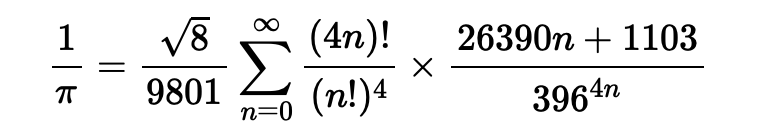

# Ramanujan-Sato-series
Calculating the value of π using the Ramanujan-Sato series in Python3, Java and C++.\
The main aim of this project will be to test the speed and accuracy of the above mentioned programming languages in the field of Mathematics, how conveniently they can carry out these highly complex calculations and the precision of Ramanujan-Sato series. 

## How to execute the program?
Just click the *RUN.bat* file or execute it manually in CMD. The result will be displayed in the Application Window.

## Conclusion
* In terms of complexity of the program and the time taken to code it, both Python3 and C++ are equally great. However I will not recommend using JAVA for any complex mathematical calculations as it is time consuming and the syntax is difficult to grasp for such operations.
* In terms of speed, the compiling speed and the time taken to execute the program, C++ is clearly victorious.
* Lastly, in terms of accuracy, Python3 beats C++, even if we use data type *long double* which is the largest floating data type in C++. In case of Python3, we get a decimal number with 15 decimal places of precision whereas in C++ only 5 decimal places of precision. 

*NOTE : The JAVA version of this project has not been uploaded yet. It will be uploaded in due course of time*
